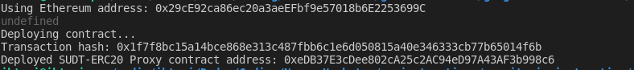
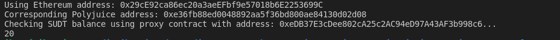

A screenshot of the console output immediately after deploying smart contract.

The address of the ERC20 Proxy Contract you deployed (in text format).

0xeDB37E3cDee802cA25c2AC94eD97A43AF3b998c6

A screenshot of the console output immediately after checking your SUDT balance.

The Ethereum address that was checked (in text format).

0x29cE92ca86ec20a3aeEFbf9e57018b6E2253699C